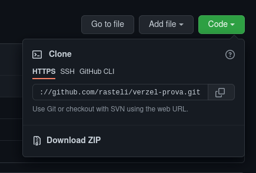

# Catalogação de aulas

## Tecnologias utilizadas

#### Front-end:

- [Sass](https://sass-lang.com/)
- [React](https://reactjs.org/)
- [Axios](https://axios-http.com/)
- [Typescript](https://www.typescriptlang.org/)
- [Socket.io-client](https://socket.io/)

#### Back-end:

- [Prisma](https://www.prisma.io/)
- [Node.js](https://nodejs.org/en/)
- [Express](https://expressjs.com/)
- [SendGrid](https://sendgrid.com/)
- [Socket.io](https://socket.io/)
- [Typescript](https://www.typescriptlang.org/)

## Instalação do projeto

Clone o repositório em sua máquina:

```
git clone https://github.com/rasteli/verzel-prova.git
```

Ou baixe o arquivo zip:



No diretório de cada aplicação _`(backend e web)`_, instale as dependências do projeto:

**Yarn**

```
yarn
```

**NPM**

```
npm install
```

### Variáveis de ambiente

Para criação e autenticação de um usuário, é utilizada uma variável de ambiente.

Para que a autenticação funcione corretamente, crie um arquivo `.env` no diretório `backend` e adicione o campo `JWT_SECRET_KEY`. Você pode definir o valor do campo como quiser, mas é recomendável que **seja algo difícil de adivinhar**.

Recomendo estas opções:

- [Kodikos](https://kodikos.vercel.app/)
- [Gerador de hash MD5](https://www.md5hashgenerator.com/)

#### SendGrid

Para o envio de emails para o usuário a fim de resetar sua senha, utilizei o serviço SendGrid. Porém, por questões de segurança, não posso expor minhas credenciais ao público. Para fazer o envio normalmente pelo formulário, é necessário que você crie [uma conta](https://signup.sendgrid.com/), adicione um template e, no arquivo `.env`, adicione os campos `SEND_GRID_API_KEY` e `SEND_GRID_TEMPLATE_ID` com os valores obtidos através da sua conta.

No entanto, ainda é possível resetar sua senha sem essa volta toda. Basta acessar a rota **/user/userId/reset-password**, onde **userId** é seu ID de usuário que pode ser obtido na tela de perfil.

#

Configurado o projeto, inicie o servidor _`(backend)`_ e a aplicação `web`. Navegue ao diretório de cada um e execute:

**Yarn**

```
yarn start
```

**NPM**

```
npm start
```

## Banco de dados

- SQLite

> Como o projeto não foi feito para estar em produção,
> optou-se por utilizar `SQLite`

O armazenamento é local. Todas as entradas do banco de dados são armazenadas em um arquivo chamado `dev.db`. Você pode encontrá-lo em [_backend/prisma_](https://github.com/rasteli/verzel/tree/master/backend/prisma).

A fim de visualizar as entradas do banco de dados, pode-se acessá-lo pelo `prisma sutdio`. Navegue até o diretório `backend` e execute:

**Yarn**

```
yarn prisma studio
```

**NPM**

```
npx prisma studio
```
